# 第一周 - 引论
## 学习目标
学习项目管理的概念并做到可以解释
1. 什么是项目管理
2. 项目管理的开销与花费
3. 掌握Project Management Body of Knowledge (PMBoK)的目的与使用

## 软件项目管理引论
软件项目管理并没有一个大一统的解决方案。每一个项目和与它相对应的条件都是独特的且没有统一的解决方案。因此，软件项目经理需要决定使用何种方法，或者说那些方案元素来应对当前的问题。
这一章节将涵盖:

1. **项目**的基本定义
2. **软件项目管理基础**的概述
3. 几个常用的**软件项目管理方案**
4. Project Management Body of Knowledge (PMBoK)
5. 为什么要管理软件项目

## 讨论问题
  1. 商业项目有什么与众不同的地方？
  2. **项目管理** 和**软件开发**有什么不同的地方？
  3. 为什么软件项目管理会有不同的途径？
  4. PMBoK是什么？为什么要在延期软件项目管理中使用它？
  5. 是真是假：**PMBok**与**敏捷** 不相容？
  6. 为什么我们要管理软件项目？
  7.软件项目管理的关键因素是什么？
  8. 敏捷项目管理是什么？

## 什么是项目

以Robert Wysocki第一章的观点来看什么是项目?

### 广义上的项目

**项目** 是一连串独特的，复杂但项目连接的活动。它必须在有限的时间，有限的预算，和明确的规范下完成一个明确的目标。

### 项目的明确的定义

**项目** 是通过一连串非独立的活动来达成预期的商业价值并通过验收。

### 程序

**程序**是一个需要按顺序完成的项目集合。

**程序**可能有多个目标。

### 投资组合

一组公用common link的项目组合。

## 项目管理的基础

参考Robert Wysocki章节1，什么是项目？什么是项目管理？

Project Management Institute (PMI)对于软件项目的定义是**在项目活动中通过知识，技能，工具和技巧的应用来达成项目的明确目标**

软件项目管理解决了6个原则性问题

* 当前项目改变了怎样一个商业现状？
* 这个商业项目的目的是什么？
* 你应当做什么？
* 如何做？
* 如何确认自己的成果。
* 如何对自己的成果做评估？

### 软件管理的定义

软件管理是一个让用户合理参与从而达到预期的增长商业价值的以常识作为基础的途径。

总结的说，**软件项目管理是一系列的常识**。

软件管理所面临的挑战：

* 灵活性和适用性
* 对商业和其背后系统的深刻理解。
* 对于软件项目管理的责任。

### 理解项目管理中的“铁三角”
在项目管理中，**时间**，**成本**和**规模**是三个相互依存且必须平衡的重要变量。其中一个的改变必须重新思考另外两个变量。
#### 项目中的约束
* 规模
* 质量
* 成本
* 时间
* 资源
* 风向

项目是一个动态的系统

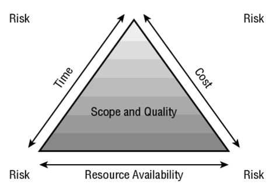
## 项目管理方法和生命周期

参考Robert Wysocki章节2，什么是项目管理？

### 例子
思考传统“编码加除错”软件开发生命周期。这有什么问题？

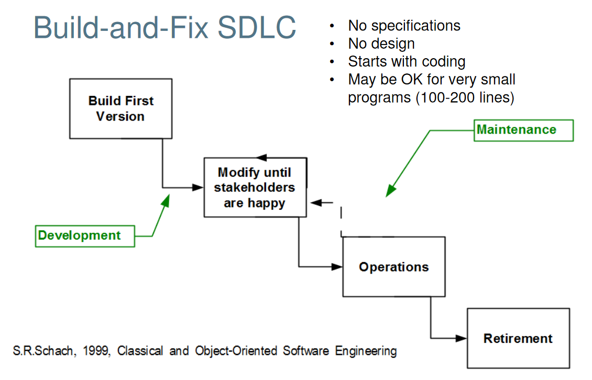

### 其他软件开发生命周期

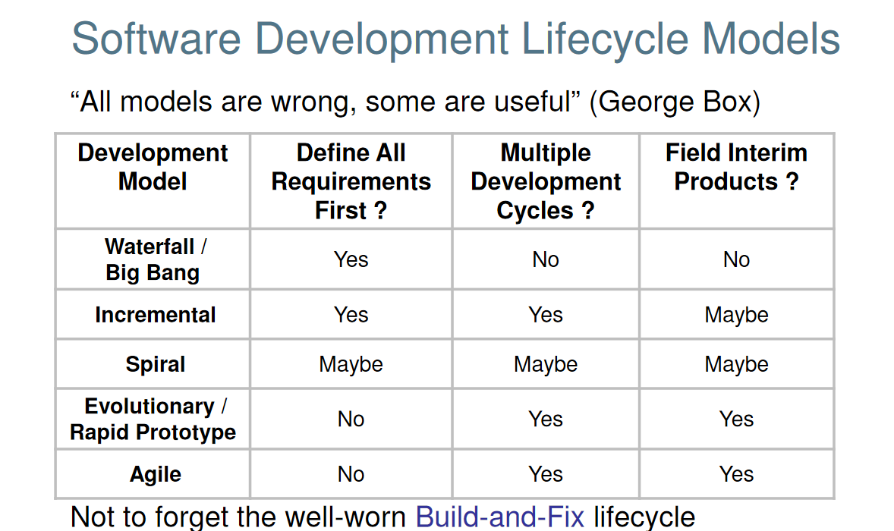

### 项目管理生命周期

项目管理生命周期是一个流程包括：

* 明确规模
* 计划
* 启动
* 监视与控制
* 收尾

项目管理无论使用什么方法，都是以**明确规模**为开始，以**收尾**为终止。每一个过程至少进行一次，有些过程有可能进行多次但是总是有一个明确的逻辑顺序。

项目经理应当使用何种方式取决于项目当前的明确性。明确性可以被归类为

* 高度明确：目标和达成目标的方案都已明确
* 部分不明确：目标已经明确但是采用何种方案还未知
* 不明确：目标不明确，方案也毫无头绪。

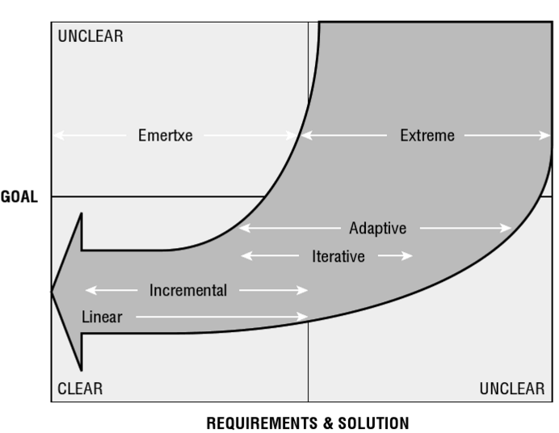

### 适用于传统方案的项目
* 目标和方案都很明确
* 大约占所有项目类型的20%，特别是那些基础设施建设项目
* 只有些微改动
* 限制
  * 不允许大变动
  * 以在规定时间和预算下完成为目的
  * 依赖于合同而不是商业价值
* 特点
  * 低复杂性
  * 项目规模几乎不变
  * 以非常成熟的技术作为基础
  * 低风险
  * 非常有经验的团队
* 线性生命周期模型
  * 极小改动
* 增量生命周期模型
  * 包括长周期反馈循环

### 适用于敏捷项目管理的项目

* **需求**必须明确但是如何实施则不需要明确
* 中高复杂度
* 特点
  * 一个已知的方案应对一个关键的问题
    * 你需要在完成项目的过程中找到合适的解决方案
    * 多重领域
    * 尚未被开发的商业领域
    * 改变驱动模型
      * 需要just-in-timme计划
    *  合适的解决方案对于组织而言是至关重要的
    *  需要客户合理参与
    *  小型的，高可用的和协同合作的多元领域团队
    *  生命周期模型
        *  迭代开发 
        *  自适应

### 适用于极限管理的项目

*  无论是目标和对应的解决方案都没有被明确
*  全新事物
*  特点
  * 研发而不是开发 
  * 风险极高
  * 成吨的变动
  * 速度快的同时也有大量的错误
  * 高速迭代

**选择合适的模型是一个主观的决定**

# 管理知识体系(PMBoK)

参考Robert Wysocki的Effective Project Management第3章。

管理知识体系（PMBok）是在项目管理领域专业知识的总结。它是在全球领域中的实践标准。

## 五个流程组
1. 启动（或称划定领域）流程组
2. 策划流程组
3. 执行（或称发射）流程组
4. 监视和调控流程组
5. 终止流程组

**流程组区别于项目管理生命周期。它们仅仅是对不同项目阶段流程的分组。一个项目的具体生命周期应当以这些流程组为基础**

## 十个领域
十个领域被凸显在完整的项目管理生命周期中。他们定义了管理的流程单经常是一个或者多个流程的一部分。

1. 项目集成管理
2. 项目规模管理
3. 项目时间管理
4. 项目成本管理
5. 项目质量管理
  * 质量计划过程
  * 质量确认过程
  * 质量控制过程
6. 项目人力管理
7. 项目交流管理
  * 谁是相关利益者？
  * 这些人需要知道什么？
  * 他们的要求都被满足了么？
8. 项目风险管理
  * 风险识别
  * 风险量化
  * 减轻风险
  * 风险监视
9. 项目采购管理
  * 征集供应商
  * 评估供应商
  * 合同列性
  * 合同谈判
  * 供应商管理
10. 相关利益者管理

# 为什么我们要管理软件开发项目与项目经理所要承担的责任

组织管理项目是为了确保项目可以产出足够的价值

但是软件开发是不同的。它是：
* 复杂的
* 抽象的
* 需求经常不明确
* 相关技术进步极快
* 相关技术可能跨越多个领域
* 不一定拥有相关技术的丰富经验
* 软件开发与科研类似
* 软件结构取决于设计
* 经常会有变动
* 变动也无法避免

**管理软件开发项目是非常困难的！**

# 什么是敏捷项目管理？

“敏捷是在及不确定的商业背景下产生或应对变动的能力”

一个敏捷的团队通过下面的途径控制变动：
* 对变动条件作出相应的调整
* 给竞争对手制造他们无法适应的变动环境

敏捷项目管理是：

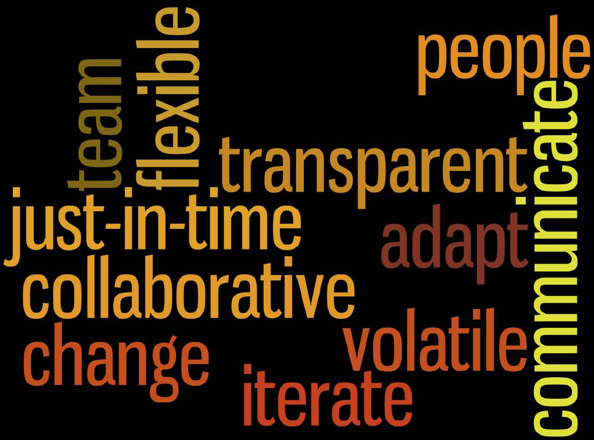

“敏捷项目管理是通过跟客户结合不断进化应对改变来实现商业价值的过程”

“敏捷项目管理通过自适应的计划，快速反馈，持续提升和密集交流协作来实现客户的价值”

敏捷项目管理使用波浪的形式管理项目。它使用“迭代”（“时间箱”）来开发一个可用的产品满足客户的需求。客户和投资人重新评估进度和需求来满足他们的要求和目标。如果有变动的话就开始一个新的迭代来改进上一个迭代的缺陷或者增加新的功能。

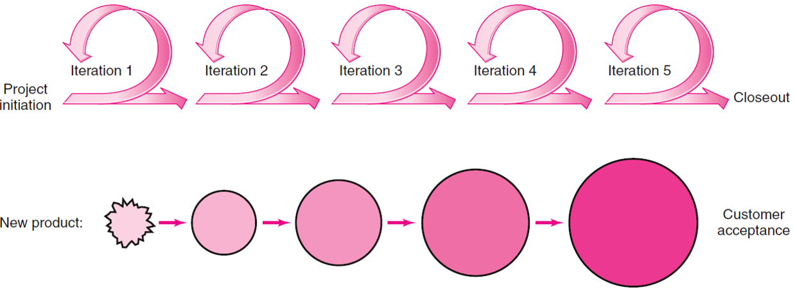

## 敏捷开发的原则
* 以客户的价值为标准
* 迭代并且增量交付
* 实验且自适应
* 自治的进步

## 敏捷方法学
敏捷方法是以复杂度原则为基础辅以复杂自适应的观念。它将一个项目视为非线性，复杂自适应系统并且响应变化和“仅够”观念来计划--以实现客户价值为中心。

敏捷管理将目光放在成员的交流上，动态交流赋予成员快速决策的能力。以快速适应为重点而不是预测，有时甚至需要自适应团队自己的流程。

敏捷管理是一个混沌与秩序的混合体。产品可以实现其目标但是方法是无法预测的。虽然流程有助于实现一致性但是却无法重复。敏捷管理的价值在于系统而不是具体的方法，此外这种管理更注重于实践而不是死板的流程。

## 敏捷方法学基础

* 小版本：帮助应对复杂度，提供更早的反馈。通常一到三个月一次。
* 迭代和增量开发：计划，需求和设计代码以增量的形式在多个迭代内进行。迭代和反馈周期是固定的（通常是两周）。固定的规模维持稳定的开发。
* 协作：所有的团队成员（包括现场的客户）协同工作。这个安排有助于交流和整合团队成员间的分歧，鼓励临时会议和设计会话。
* 释出计划/功能积压：急切需要上线的功能由客户安排其优先级。优先级的安排在一个协同的释出计划安排活动（以博弈论为基础）。开发者提供EAT，客户决定优先级。
* 迭代计划/任务积压：在释出的高级功能计划的优先级取决于迭代计划中的实现任务。优先级在一个迭代计划安排活动中协同确定。开发者提供EAT，客户决定优先级。
* 追踪：功能和任务以迭代为基础来追踪。追踪的结果要不就是完成要不就是没完成，没有部分完成这一说。我们在开始前就对什么是“完成”给出明确定义。
* 自我管理团队：成员以积压表为准则做自顶向下的自我管理。
* 从简，学习和自适应：整个工作无论从哪个方面来讲都要尽可能从简。在高速变化的条件下实现客户价值。
* 配对：两两组队分享经验提升质量！
* 测试驱动开发：开发者应该在开发系统前设计测试，系统的开发应当以满足测试为原则。大多数情况下，测试比系统设计更加明确。
* 注记：测试却动开发和配对在极限开发中非常常用。

## 敏捷项目经理

“当使用敏捷项目管理时，敏捷流程比什么都重要”，特别是Scrum“别把自己套进‘项目经理的套子里’”。

## 流行的敏捷方法
* Scrum
* 动态系统开发
* 水晶开发
* 功能驱动开发
* 单纯开发
* 极限开发
* 自适应软件开发
* Kanban
* 敏捷见哦
* 快速产品开发
* 传统统一流程

## 敏捷方法学
敏捷方法学包括：
* 建模：并不是单纯的打一个文件放那吃灰
* 写文档：并不是几万词的大文章而且没人想更新
* 策划：接受在多变环境下的限制

## 使用敏捷管理的优势

敏捷项目管理特别适用于打破技术限制或者定义关键功能。通过持续的迭代，验证和进化，产品越来越接近用户心中所想要的形态并满足用户的最终需求。这个方法特别能在早期就把问题揪出来。

## 敏捷管理的限制

敏捷管理无法满足高等级管理中对于预算，规模和日程管理的要求。它的自治和封闭合作与合作文化不相容。此外，这种管理方法并不适合于大团队（超过5-9的限制）。而且，它依赖于客户的反馈，如果客户部反馈就没法进行。

## 传统项目管理vs敏捷项目管理

### 传统项目管理
* 在一开始就得把整个项目全部策划好
* 需要极为精准的预测

### 敏捷项目管理

* 以增量，迭代开发循环的方法来应对无法完全预测的项目
* 是充斥着大量新科技的实验性项目的理想选择
* 将眼光放在跟客户的协同合作上满足用户的需求

### 在大型项目上使用敏捷开发

* *缩放*是很多团队正在使用的可以同时工作在一个项目不同功能的技术
* *分期*需要大量的前期准备工作来确保相互依赖的功能正常开发。它同样包含开发协议来规定角色和进度还有相互兼容性保持和谐

### 敏捷组织

一个组织可以在发现上个星期的方法不一定再奏效的时候很迅速的改变自己的前进方向。他们再所有需求都在变化的混沌条件下将结构与灵活性相平衡。最终混沌和秩序间的平衡将带来胜利

### 敏捷项目管理时间之一 - Scrum方法

Scrum方法是一个跨功能团队开发新产品的方法。它将产品的功能定义为*交付*并且依据它能产生的价值给它优先级。优先级再每一次迭代（冲刺）后都将重新评估来达到用户的需求。

Scrum由四个阶段组成：

* 分析
* 设计
* 构建
* 测试

#### Scrum生命周期

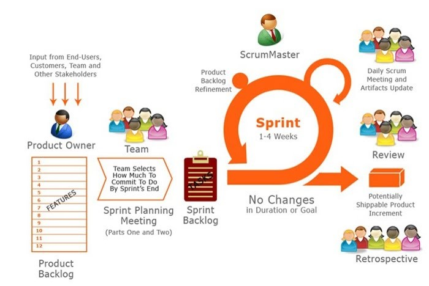

#### Scrum开发流程
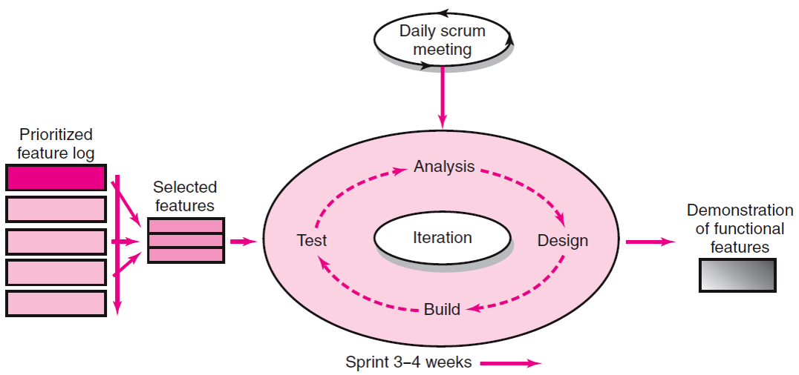

#### Scrum中的关键角色和责任

* **产品拥有者**：作为用户展现他们的兴趣
* **开发团队**：一个拥有5-9名成员且跨领域的团队。其职责是完成并交付产品
* **Scrum大师（或者项目经理）**：作为团队和外部之间的沟通接口，帮助团队解决组织层面的问题或者解决障碍。

#### Scrum会议
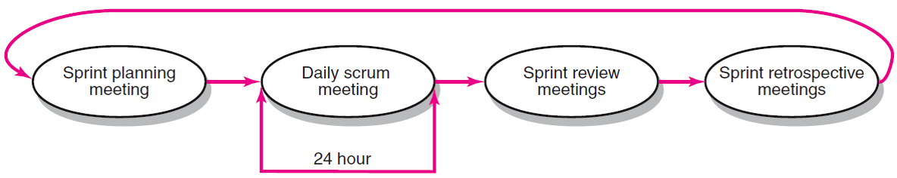

#### 部分产品目标
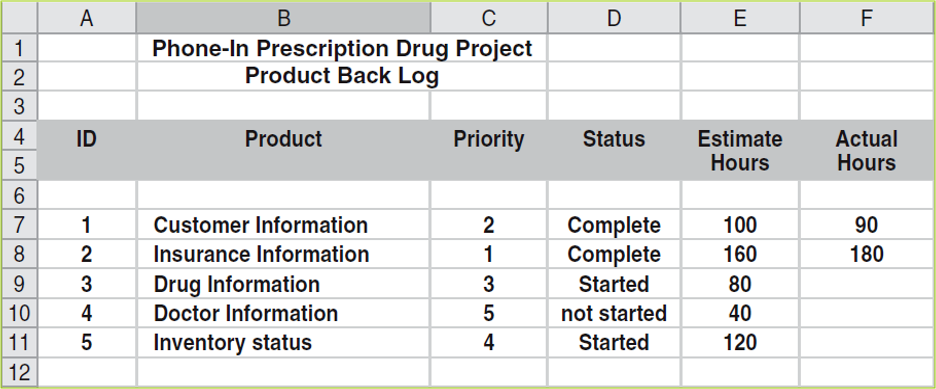

#### 部分冲刺目标
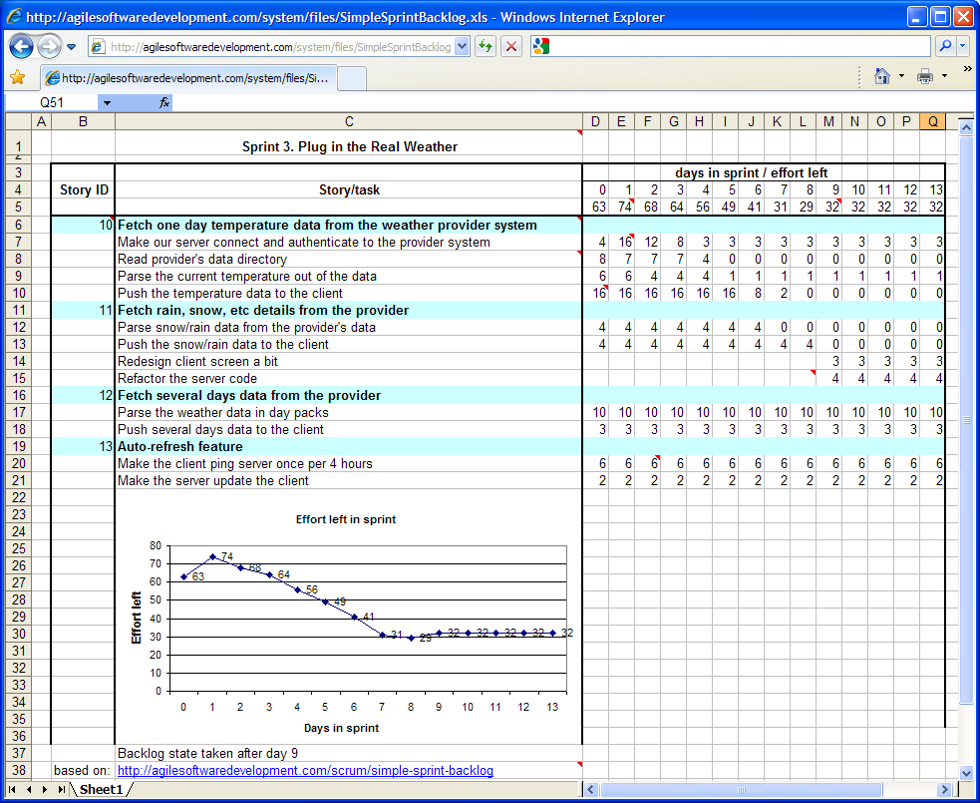
